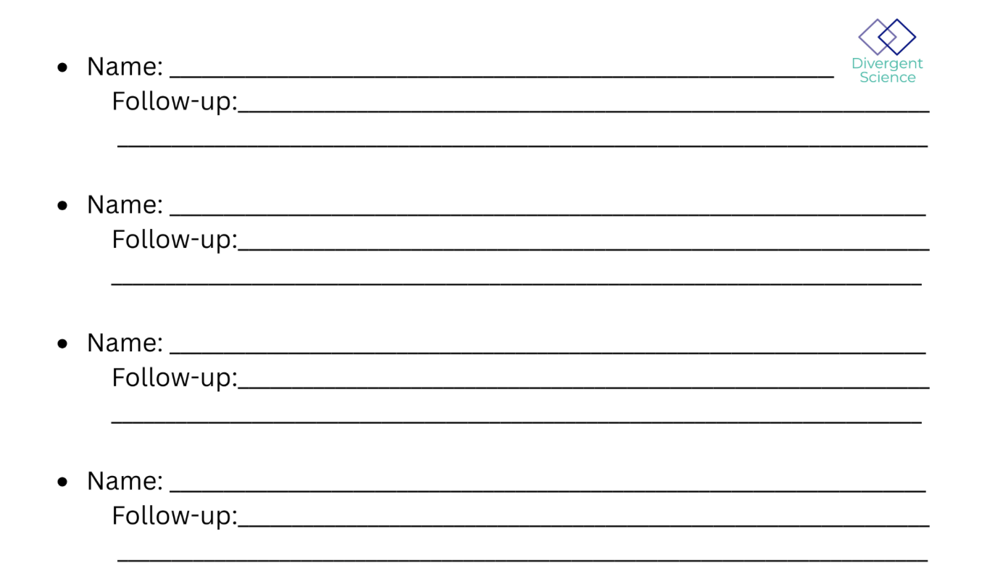
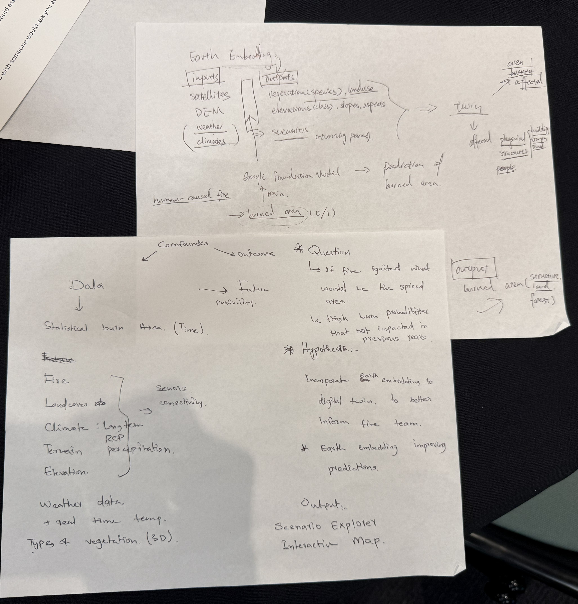
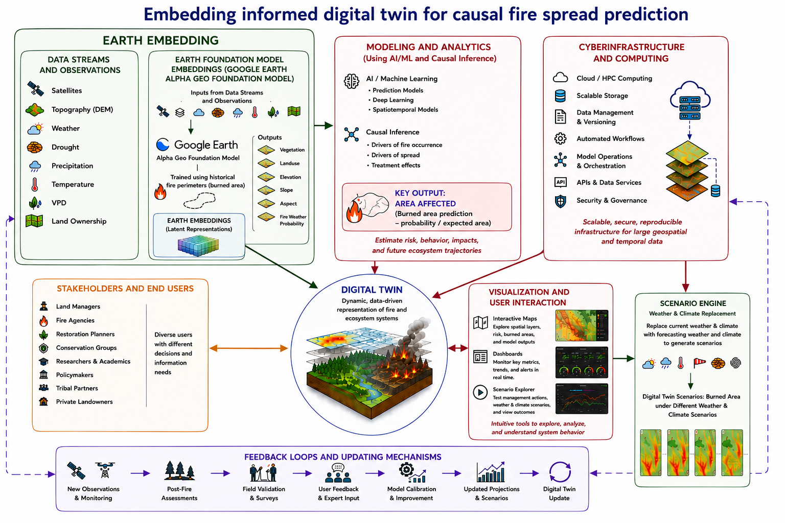
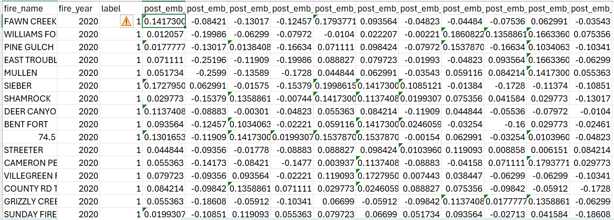
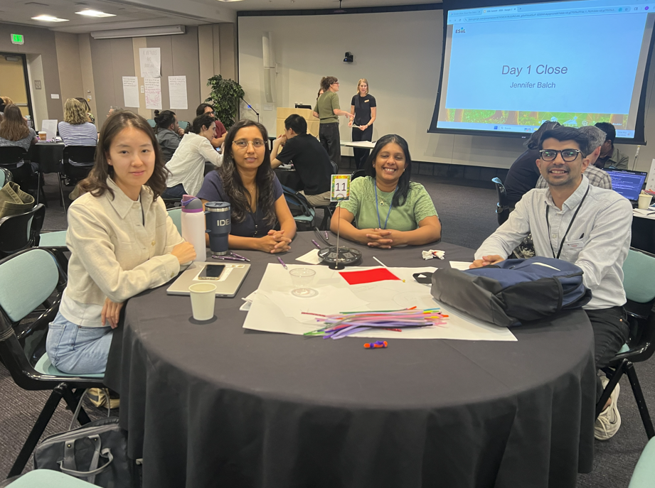
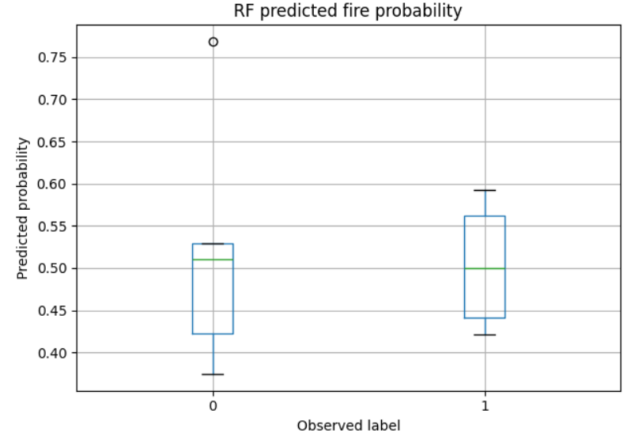
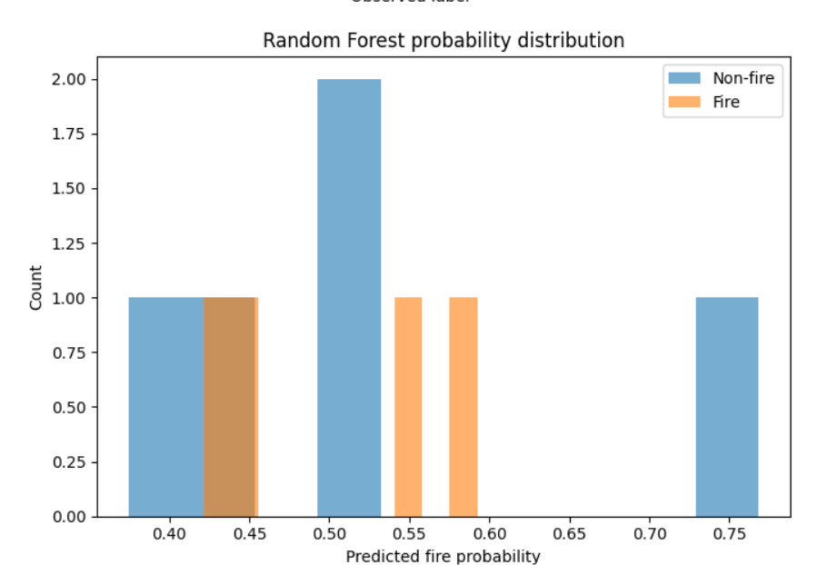
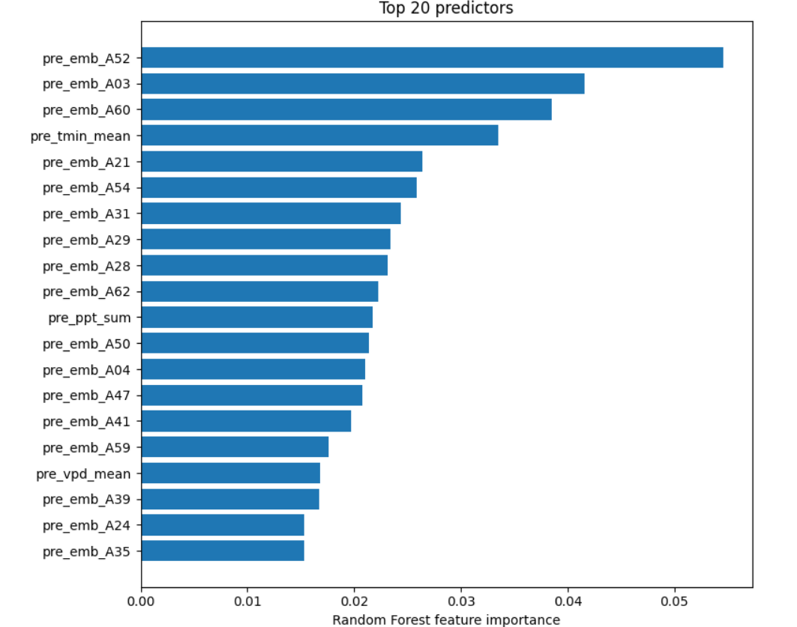
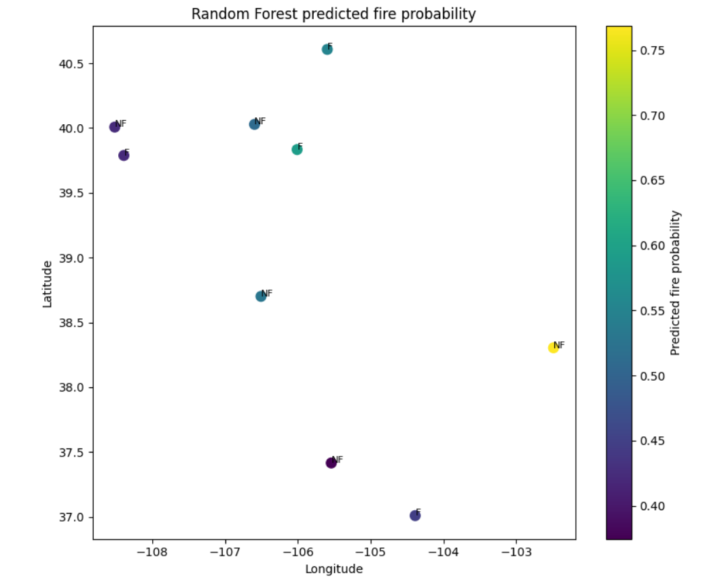

!!! tip "How to use this page during the Summit"
    - This page is your team’s shared workspace and final report-out page. It captures your group’s process and thinking throughout the Summit and will be used to share your work with others. 
    
    - Use this page as your team’s working record during the Summit and your final report-out.
    
    - The Summit has several different goals and thus you will use the page differently each day: Day 1 is for alignment, Day 2 is for building one useful thing, and Day 3 is for synthesis and report- out.
    
    - Look for the green buttons to indicate what you need to edit. 
    
    - Megaphones 📣 indicate which items you will be presenting during the end-of-day report-outs.

    - Only the items with megaphones will be visible when you hit the 'Summit Report Out' button. 

    - If you turn off 'Instructions' then you will only see the page content for public display.
    

# TwinFlames
## Use the power of embedding and digital twin to identify probable burn area if we detect an ignition location near real time. 📣

!!! note "Day 1 directions"
    Change the title to the name of your project.

    [Edit Day 1 setup in Markdown](https://github.com/CU-ESIIL/Summit_group_2026_11/edit/main/docs/index.md?plain=1#L21){ .md-button target="_blank" rel="noopener" }

!!! tip "For ESIIL staff"
    Group Number: 11
    
    Breakout Room #: Auditorium

    [ESIIL staff edit in Markdown](https://github.com/CU-ESIIL/Summit_group_2026_11/edit/main/docs/index.md?plain=1#L28){ .md-button target="_blank" rel="noopener" }

!!! note "How to replace the image above"
    Upload an image that represents your project and welcome people to your page. 
    
    Upload your own image to `assets/hero/` and replace the file named `hero.png`. Use a wide image if you can, then refresh the site preview to check how it looks.
    Keep the file path `assets/hero/hero.png` if you want the Markdown above to keep working.

    [Open image folder for changing image](https://github.com/CU-ESIIL/Summit_group_2026_11/tree/main/assets/hero){ .md-button target="_blank" rel="noopener" }

[See a completed example](example.md){ .md-button }

## People { #people .oasis-report-out-context }

!!! note "Day 1 task"
    Get to know your team: share your cards (5-7 mins). Update your team roster (2-3 min).

    Use the in-person name cards to guide quick introductions.

    | Name card prompts | Follow-up notes |
    |---|---|
    |  |  |

    [Edit People in Markdown](https://github.com/CU-ESIIL/Summit_group_2026_11/edit/main/docs/index.md?plain=1#L63){ .md-button target="_blank" rel="noopener" }

| Name | Affiliation | Contact | Github |
|---|---|---|---|
|Danish Kumar | University of Maryland | dkumar18@umd.edu| dkumar18-umd|
|Nayani Ilangakoon | CIRES| ginikanda.ilangakoon@colorado.edu|chathu84 |
| Yuying Ren | University of Colorado Boulder | yuying.ren@colorado.edu | YuyingRenCU |
| Asha Paudel | NextEra Energy| paudelasha@gmail.com | paudelasha |

## Team Norms and Decision Making { #team-norms-and-decision-making }

!!! note "Day 1 task"

Our team norms:

- Turn taking
- Transparent on AI use
- Dot voting (2 votes each)
- Gradients of agreement

Our decision making strategy:

We will use gradient-of-agreement checks for major choices and or move to voting if we hit any bottlenecks

    [Edit content below here in Markdown](https://github.com/CU-ESIIL/Summit_group_2026_11/edit/main/docs/index.md?plain=1#L106){ .md-button target="_blank" rel="noopener" }

Short term:

- Create workflow for integrating earth embedding to inform digital twin for fire detection and impact area estimates

Long term:

-Interactive maps with spatial layers on risk, previous burned and potential impacted areas and model outputs

-Digital twin scenario explorer with weather data and impact area estimates for particular location

-Dashboard to monitor key metrics and trends over time

*Morning whiteboard or notes showing the question, hypotheses, and context we used to start Day 2.*

## Our question(s) 📣 { #project-question .oasis-report-out-section .oasis-report-out-day2 }

Our working question:

-What is the affected burn area if ignited?
...

What would count as progress:

-Create a reproducable workflow incorporating earth embeddings to inform digital twin 

-Earth embeddings for potential impacted areas/footprints 

#Workflow Image

## Hypotheses/Intentions [Optional: probably not relevant if you are creating an educational tool]

- Causal inference and earth embedding can improve prediction/estimation of fire impacted areas if ignition happens and help inform decision making. 
- The idea is to input fire ignition locations as soon as we detected one (may be from GOES-R satellite data for real-time fire detection) to the twin model
- Retrieve weather data closest that time
- Retrive embedding data from 5 day-sentinel-2 or any closeset data to the time of ignition detection
- then run the model and provide best estimate of probable burn area so that managment teams can act before the fire reach. 

## Why this matters (the “upshot”) 📣 { #why-this-matters .oasis-report-out-section .oasis-report-out-day2 }

This matters because: Wildfires threaten human life, damages infrastructure and impact livelihoods and local economies. As climate changes, early prediction and limiting its impact can save lives and reduce its impact on economy. Our project leverages earth observation embeddings to build fire spread models that are more accurate and computationally efficient than conventional approaches, then delivers those results through interactive digital twins that translate complex science into clear, actionable intelligence.

People who could use this: Local governments, fire fightings teams, forest services 

...

## Data sources we’re exploring 📣 { #data-exploration .oasis-report-out-section .oasis-report-out-day2 }

-GEE fire database for colorado for 2020

-Earth Embeddings data from google AlphaEarth Foundation

*Snapshot showing initial data patterns.*

Promising data sources:

- [Data source 1](#): GridMet climate data
- [Data source 2](#): SRTM based elevation, slope, and aspect
- [Data source 3](#): MTBS fire perimeter and area polygons
- [Data source 4](#): ...

## Methods/technologies we’re testing 📣 { #methods-and-code .oasis-report-out-section .oasis-report-out-day2 }

!!! note "methods"
    Add 2-4 methods/technologies we're testing (stats, models, viz).

[View shared code](https://github.com/CU-ESIIL/Summit_group_2026_11/tree/main/code){ .md-button }

Methods/technologies we are testing:

| Method or technology | What we tested | Early note |
|---|---|---|
| ... | ... | ... |
| ... | ... | ... |
| ... | ... | ... |
| ... | ... | ... |

### Challenges identified

- ...
- ...

### Next Steps

Short term: 

Long term: 

!!! note "Day 3 Tasks"
    Sythesis: highlight 2-3 visuals that tell the story; keep text crisp. Practice a 6-minute walkthrough of the homepage. Why -> Questions -> Data/Methods -> Findings -> Next 

    [Edit content below here in Markdown](https://github.com/CU-ESIIL/Summit_group_2026_11/edit/main/docs/index.md?plain=1#L203){ .md-button target="_blank" rel="noopener" }

## Team Photo { #team-photo }

*Team members and collaborators who contributed to this project.*

## Findings at a glance 📣 { #findings-at-a-glance .oasis-report-out-section .oasis-report-out-day3 }

Headline 1 — what, where, how much

Headline 2 — change/trend/contrast

...

Headline 3 — implication for practice or policy

...

## Visuals that tell a story 📣 { #story-visuals .oasis-report-out-section .oasis-report-out-day3 }

*Visual 1: the main pattern or output we want people to remember.*

## What’s next? 📣 { #whats-next .oasis-report-out-section .oasis-report-out-day3 }

Short term:

- ...

Long term:

- ...

Who should see this next

- ...

## Cite & Reuse { #cite-reuse }

If you use these materials, please cite:

Summit Team. (2026). *Summit Group 2026 Team 11 — Innovation Summit 2026*. https://github.com/CU-ESIIL/Summit_group_2026_11

License: CC-BY-4.0 unless noted. 
